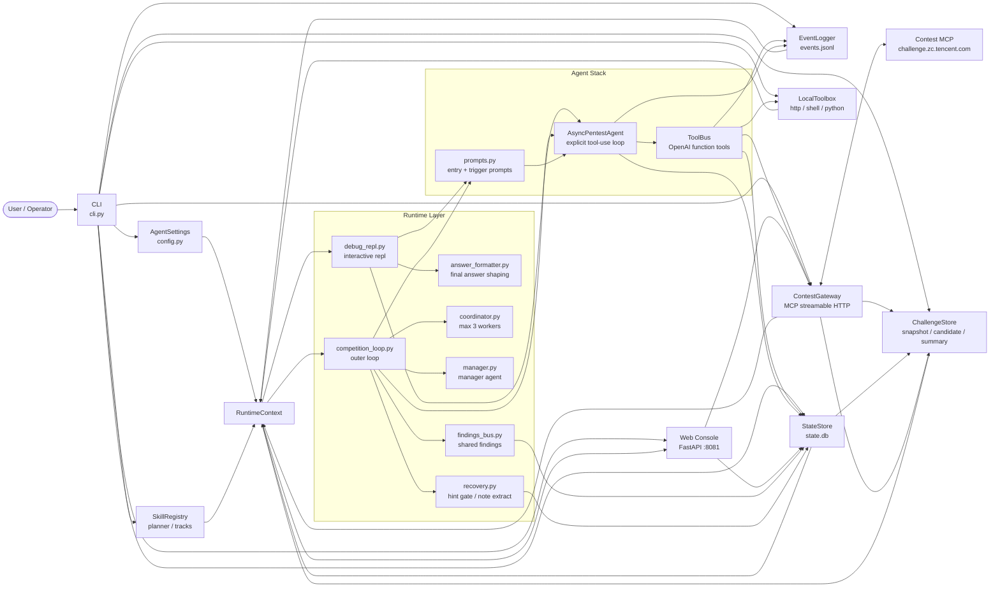
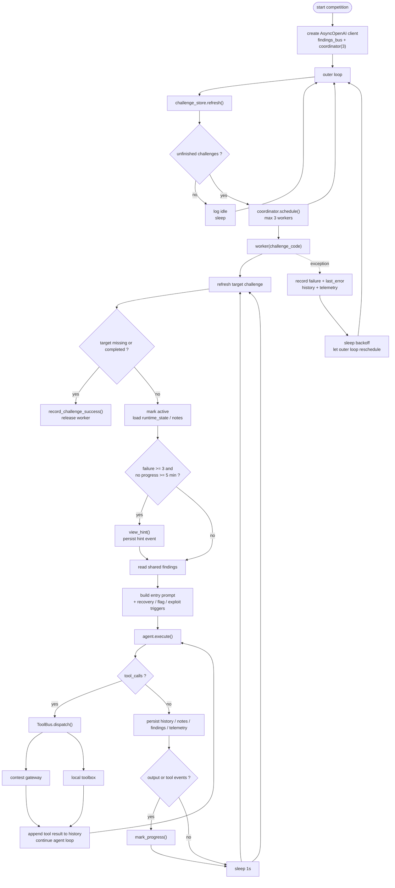

# niuniu-agent 架构图与流程图

本文档只描述当前仓库已经落地的真实实现，不画“未来设想图”。

对应代码入口：

- `CLI`：[src/niuniu_agent/cli.py](../src/niuniu_agent/cli.py)
- `control_plane`：[src/niuniu_agent/control_plane](../src/niuniu_agent/control_plane)
- `agent_stack`：[src/niuniu_agent/agent_stack](../src/niuniu_agent/agent_stack)
- `runtime`：[src/niuniu_agent/runtime](../src/niuniu_agent/runtime)
- `state`：[src/niuniu_agent/state_store.py](../src/niuniu_agent/state_store.py)
- `skills`：[src/niuniu_agent/skills](../src/niuniu_agent/skills)

## 1. 架构图



## 2. Debug 模式流程图

```mermaid
flowchart TD
    start([start debug])
    init["run_debug_repl()<br/>create AsyncOpenAI client"]
    first_snapshot["challenge_store.refresh()<br/>print challenge summary"]
    input["read user input"]
    exitq{"exit / quit ?"}
    refresh["refresh snapshot<br/>select active challenge"]
    load["load runtime_state + notes<br/>infer track + plan skills"]
    build["build entry prompt<br/>+ trigger prompts"]
    run["agent.execute_stream()"]
    toolq{"tool_calls ?"}
    dispatch["ToolBus.dispatch()"]
    official["official contest tools<br/>start / stop / submit / hint"]
    local["local tools<br/>http / shell / python"]
    append["append tool result to history<br/>continue model loop"]
    formatq{"need formatted answer ?"}
    format["answer_formatter.stream_formatted_answer()"]
    raw["print raw model answer"]
    done["print final answer"]

    start --> init --> first_snapshot --> input
    input --> exitq
    exitq -- yes --> end([leave repl])
    exitq -- no --> refresh --> load --> build --> run
    run --> toolq
    toolq -- yes --> dispatch
    dispatch --> official
    dispatch --> local
    official --> append
    local --> append
    append --> run
    toolq -- no --> formatq
    formatq -- yes --> format --> done --> input
    formatq -- no --> raw --> input
```

## 3. Competition 模式流程图



## 4. 读图说明

- `debug` 是单会话交互链路，重点是“显式 tool-use loop + 工具进度可见 + 最终答案整理”。
- `competition` 是外层不停机调度链路，重点是“outer loop + coordinator + 最多 3 个 worker + findings bus + 恢复/退避”。
- `web` 现在是单独的控制面入口，读取 challenge snapshot、agent status、agent events，并可在线调试 debug agent。
- 比赛约束不是只写在 prompt 里，`ToolBus` 和 `recovery` 已经把实例上限、flag 提交后停实例、hint 5 分钟门槛等规则落实到代码路径里。
